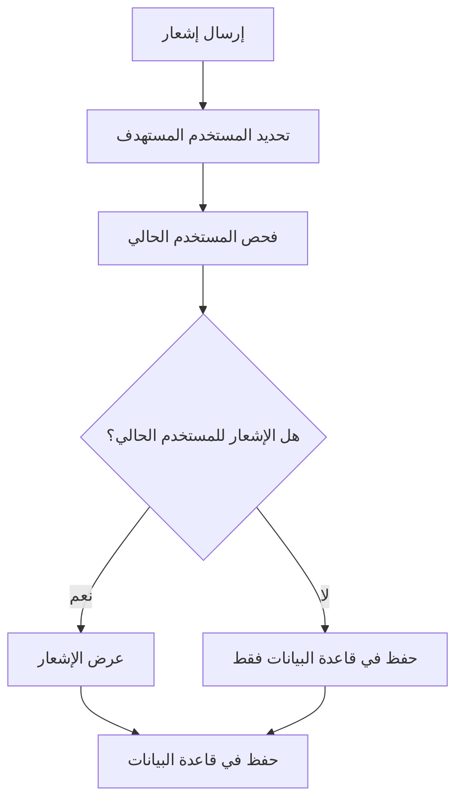
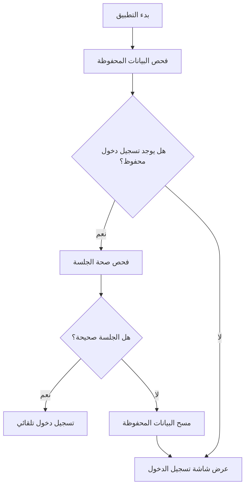

# 🔔 دليل النظام المحسن للإشعارات والمصادقة - كيدز باص

## 🎯 نظرة عامة

تم تطوير نظام محسن للإشعارات والمصادقة يضمن:
- **إشعارات مخصصة لكل مستخدم** - تظهر فقط للمستخدم المستهدف
- **الحفاظ على تسجيل الدخول** - لا يخرج المستخدم عند إغلاق التطبيق
- **إشعارات خارج التطبيق** - تعمل حتى عندما يكون التطبيق مغلق

## 🚀 المميزات الجديدة

### ✅ الإشعارات المخصصة
- إشعارات تظهر فقط للمستخدم المحدد
- دعم الإشعارات في الخلفية والمقدمة
- صوت واهتزاز مخصص لكل إشعار
- حفظ تلقائي للإشعارات في قاعدة البيانات

### ✅ المصادقة المستمرة
- الحفاظ على تسجيل الدخول عند إغلاق التطبيق
- خيار "تذكرني" للمستخدمين
- تسجيل خروج عادي أو كامل
- فحص صحة الجلسة تلقائياً

### ✅ الأمان المحسن
- تشفير البيانات المحفوظة
- انتهاء صلاحية الجلسات القديمة
- فحص صحة المستخدم قبل عرض الإشعارات

## 📁 الملفات الجديدة

```
lib/services/
├── enhanced_push_notification_service.dart    # خدمة الإشعارات المحسنة
├── persistent_auth_service.dart               # خدمة المصادقة المستمرة
└── enhanced_background_handler.dart           # معالج الرسائل في الخلفية

lib/screens/
├── auth/enhanced_login_screen.dart            # شاشة تسجيل دخول محسنة
└── settings/notification_auth_settings_screen.dart  # شاشة الإعدادات
```

## 🛠️ كيفية الاستخدام

### 1. تهيئة النظام

```dart
// في main.dart
await EnhancedPushNotificationService().initialize();
await PersistentAuthService().initialize();
```

### 2. تسجيل الدخول مع "تذكرني"

```dart
final authService = PersistentAuthService();

final user = await authService.signInWithEmailAndPassword(
  email: email,
  password: password,
  rememberMe: true, // الحفاظ على تسجيل الدخول
);
```

### 3. إرسال إشعار لمستخدم محدد

```dart
final notificationService = EnhancedPushNotificationService();

await notificationService.sendNotificationToUser(
  userId: 'user_id_here',
  title: 'عنوان الإشعار',
  body: 'محتوى الإشعار',
  data: {
    'type': 'student_boarded',
    'studentId': 'student_123',
  },
);
```

### 4. تسجيل الخروج

```dart
// تسجيل خروج عادي (يحفظ بعض البيانات)
await authService.signOut();

// تسجيل خروج كامل (يمسح جميع البيانات)
await authService.signOut(clearPersistedData: true);
```

## 🔧 الإعدادات المتاحة

### إعدادات المصادقة
- **تسجيل الدخول التلقائي**: تفعيل/إلغاء الحفاظ على تسجيل الدخول
- **مدة الجلسة**: 30 يوم افتراضياً
- **فحص صحة الجلسة**: تلقائي عند بدء التطبيق

### إعدادات الإشعارات
- **تفعيل الإشعارات**: تشغيل/إيقاف الإشعارات
- **الصوت**: تشغيل/إيقاف صوت الإشعارات
- **الاهتزاز**: تشغيل/إيقاف اهتزاز الإشعارات

## 📱 كيفية عمل النظام

### 1. الإشعارات المخصصة



### 2. المصادقة المستمرة



## 🔍 استكشاف الأخطاء

### مشاكل الإشعارات

**المشكلة**: الإشعارات لا تظهر
```dart
// الحل: فحص الأذونات
final settings = await FirebaseMessaging.instance.requestPermission();
print('Permission status: ${settings.authorizationStatus}');
```

**المشكلة**: الإشعارات تظهر للمستخدم الخطأ
```dart
// الحل: التأكد من تحديد userId في البيانات
await notificationService.sendNotificationToUser(
  userId: correctUserId, // تأكد من صحة المعرف
  title: title,
  body: body,
  data: {
    'userId': correctUserId, // إضافة المعرف في البيانات أيضاً
    'recipientId': correctUserId,
  },
);
```

### مشاكل المصادقة

**المشكلة**: المستخدم يخرج عند إغلاق التطبيق
```dart
// الحل: التأكد من تفعيل "تذكرني"
await authService.signInWithEmailAndPassword(
  email: email,
  password: password,
  rememberMe: true, // تأكد من تفعيل هذا الخيار
);
```

**المشكلة**: الجلسة تنتهي بسرعة
```dart
// الحل: فحص إعدادات انتهاء الصلاحية
final sessionInfo = await authService.getSessionInfo();
print('Login timestamp: ${sessionInfo['loginTimestamp']}');
```

## 📊 مراقبة الأداء

### إحصائيات الإشعارات
```dart
// فحص عدد الإشعارات المرسلة
final notificationLogs = await FirebaseFirestore.instance
    .collection('notification_logs')
    .where('type', isEqualTo: 'background')
    .get();

print('Total notifications: ${notificationLogs.docs.length}');
```

### إحصائيات المصادقة
```dart
// فحص معلومات الجلسة
final sessionInfo = await authService.getSessionInfo();
print('Session info: $sessionInfo');
```

## 🎨 التخصيص

### تخصيص الإشعارات
```dart
// تخصيص شكل الإشعار
const androidDetails = AndroidNotificationDetails(
  'mybus_notifications',
  'كيدز باص',
  channelDescription: 'إشعارات تطبيق كيدز باص',
  importance: Importance.high,
  priority: Priority.high,
  sound: RawResourceAndroidNotificationSound('custom_sound'), // صوت مخصص
  icon: '@mipmap/custom_icon', // أيقونة مخصصة
  color: Colors.blue, // لون مخصص
);
```

### تخصيص المصادقة
```dart
// تخصيص مدة الجلسة
const sessionDuration = Duration(days: 60); // 60 يوم بدلاً من 30

// تخصيص إعدادات الحفظ
await authService.setAutoLoginEnabled(false); // إلغاء التسجيل التلقائي
```

## 🔐 الأمان

### حماية البيانات
- تشفير البيانات المحفوظة محلياً
- فحص صحة الجلسة دورياً
- انتهاء صلاحية الجلسات القديمة
- مسح البيانات عند تسجيل الخروج الكامل

### أفضل الممارسات
1. **استخدم تسجيل الخروج الكامل** عند الحاجة لأمان إضافي
2. **فحص صحة الجلسة** دورياً في التطبيقات الحساسة
3. **تحديد المستخدم المستهدف** في جميع الإشعارات
4. **مراقبة logs الإشعارات** لضمان الوصول الصحيح

## 📞 الدعم

### الحصول على المساعدة
- راجع logs التطبيق للأخطاء
- استخدم شاشة الإعدادات لفحص الحالة
- تحقق من أذونات الإشعارات في النظام

### الإبلاغ عن المشاكل
- احفظ logs الأخطاء
- وصف الخطوات المؤدية للمشكلة
- اذكر نوع الجهاز ونسخة النظام

---

## 🎉 الخلاصة

النظام المحسن للإشعارات والمصادقة يوفر:
- **تجربة مستخدم سلسة** مع الحفاظ على تسجيل الدخول
- **إشعارات دقيقة ومخصصة** لكل مستخدم
- **أمان عالي** مع إمكانية التحكم الكامل
- **سهولة الاستخدام** مع إعدادات مرنة

تم تصميم النظام ليكون **موثوق** و **آمن** و **سهل الصيانة** لضمان أفضل تجربة في تطبيق كيدز باص 🚀